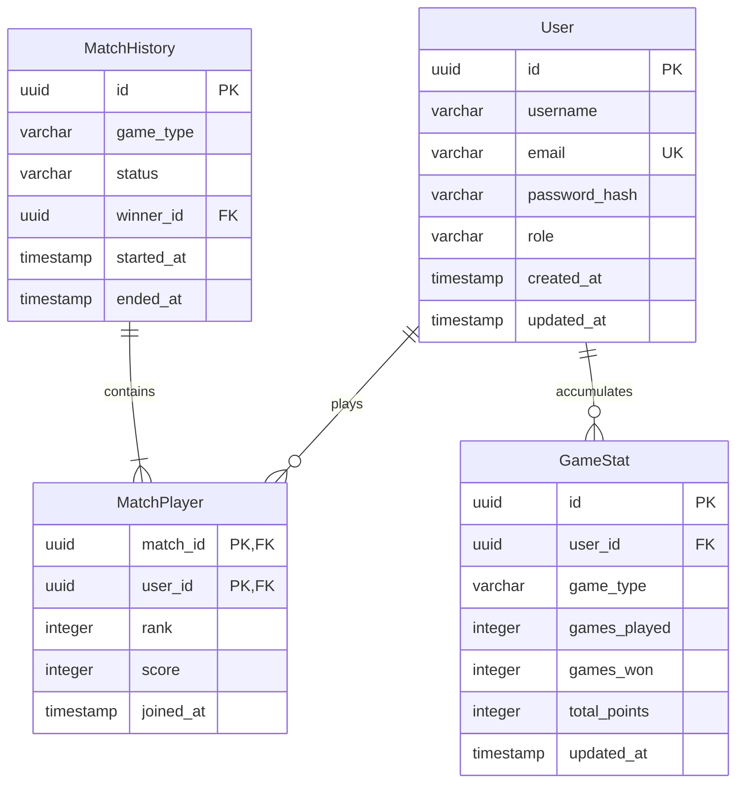

# Authentication and Database Architecture Analysis for TurnUp.io

This document provides a comprehensive architectural analysis and recommendation for the authentication, session management, database access, and password hashing stack for the TurnUp.io real-time board game portal.

---

## 1. Session Management: JWT vs. Database-backed Sessions

For a real-time multiplayer board game portal running on Node.js, Express, and Socket.io, connection handshakes and user identity validation are on the critical path. The portal must support both registered users (with persistent stats) and guest logins (temporary sessions).

### Comparison Matrix

| Feature | Stateless JWT (Recommended) | Database-backed Sessions (Redis / Postgres) |
| :--- | :--- | :--- |
| **Storage Location** | Client-side (e.g., LocalStorage / HttpOnly Cookie). | Server-side database + Client-side Session ID cookie. |
| **Verification Speed** | **Fast** (Cryptographic validation in-memory, no DB hit). | **Slower** (Requires querying the database/Redis on every lookup). |
| **Scalability** | **Excellent** (Stateless, any node instance can verify). | **Good** (Requires shared session store like Redis for multi-instance). |
| **Session Revocation** | **Hard** (Valid until expiration, requires blacklist). | **Easy** (Delete session ID from store for immediate logout/ban). |
| **Guest Login Overhead**| **Zero DB Bloat** (Guest state is encoded in token). | **High DB Bloat** (Requires writing session records for every guest). |

### Architectural Decision
**Recommendation: Stateless JSON Web Tokens (JWT) with Socket-level Connection Binding.**

#### Justification:
1. **Low-Latency Connection Handshake**: In Socket.io, authentication occurs during the initial connection handshake. A stateless JWT allows the Socket.io server to verify the player’s credentials in microseconds using a shared secret key, completely bypassing the database.
2. **Stateful Socket Binding**: Once authenticated, the socket connection is persistent and stateful. The player's identity (`playerId`, `username`, `role`) is bound directly to the socket context (`socket.data.playerId`). Subsequent game events (like dice rolls or card moves) do not need to re-verify the token; they rely on the trusted socket state, ensuring zero authentication overhead during gameplay.
3. **Guest Management without Database Bloat**: Guest logins are crucial for minimizing friction in web-based casual games. With JWTs, the server can issue a signed token containing a guest payload: `{ "id": "guest_uuid", "username": "Guest_Blue", "role": "GUEST" }`. The server does not write anything to the database on login. If the guest eventually registers or we record stats, we write to Postgres then, keeping database writes clean and efficient.

---

## 2. Database Access: node-postgres (`pg`) vs. Prisma ORM

TurnUp.io is built with TypeScript and manages distinct game schemas (Ludo, Uno, Monopoly, etc.) and statistics. Choosing the database access layer involves balancing type safety, performance, and developer velocity.

### Comparison Matrix

| Feature | node-postgres (`pg`) | Prisma ORM (Recommended) |
| :--- | :--- | :--- |
| **Type Safety** | Manual (Interfaces must be manually cast). | **Automatic** (Type-safe client auto-generated from schema). |
| **Developer Velocity** | Slow (Manual CRUD queries and table mappings). | **Fast** (Intuitive API, auto-completions, relation helpers). |
| **Migrations** | Manual (Requires external migration tool like `db-migrate`). | **Automatic** (`prisma migrate` generates SQL migration scripts). |
| **Performance** | **Maximum** (Zero wrapper overhead, raw query speed). | **Moderate** (1-3ms query planning/Rust engine overhead). |
| **Schema Maintenance** | Hard (SQL scripts and TypeScript models drift easily).| **Easy** (Single source of truth in `schema.prisma`). |

### Architectural Decision
**Recommendation: Prisma ORM.**

#### Justification:
1. **Non-Blocking Database Access Patterns**: Unlike real-time action games, board games are turn-based. Active gameplay states (token coordinates, current turn, player cash) are processed entirely in-memory on the Node/Socket.io server. The database is only queried for user authentication on login and written to at the *end* of a match to save stats. The minor query overhead of Prisma (1-3ms) is completely unnoticeable in these async, low-frequency operations.
2. **TypeScript Integration & Type Safety**: Board games have highly structured stats (e.g., properties owned, cards remaining, rank standings). Prisma auto-generates TypeScript types directly from the database schema, eliminating mismatch errors between the application logic and DB models.
3. **Migration Velocity**: As TurnUp.io scales and introduces new rulesets, schema modifications will be common. Prisma's migration CLI provides reliable, declarative schema evolution out of the box.

---

## 3. Password Hashing: Bcrypt vs. Node Native `scrypt`

Securing user passwords requires a computationally intensive hashing algorithm to resist brute-force attacks.

### Comparison Matrix

| Feature | Bcrypt | Node Native `scrypt` (Recommended) |
| :--- | :--- | :--- |
| **Dependency Management** | Requires native C++ compilation (frequently fails on Windows). | **Zero Dependencies** (Built directly into Node runtime). |
| **Security Design** | CPU-hard only. | **Memory-hard & CPU-hard** (Resists GPU/ASIC acceleration). |
| **Standardization** | De facto industry standard for web. | Modern standard recommended by OWASP. |
| **Execution Performance** | Fast in C++ binding; Slow in pure JS fallback. | **Fast native C++ execution** inside the Node standard library. |

### Architectural Decision
**Recommendation: Node.js Native `crypto.scrypt` (wrapped in a clean utility class).**

#### Justification:
1. **Windows Developer Environment Stability**: Because TurnUp.io is developed on Windows, external packages that rely on native C++ compilers (like `bcrypt`) commonly cause build failures during `npm install`. Node's standard `crypto` module runs natively compiled C++ code directly inside the V8 engine, eliminating any installation compile errors.
2. **Resistance to Hardware-Accelerated Attacks**: Modern password cracking uses GPUs and ASICs. Bcrypt is only CPU-hard, meaning GPUs can parallelize guesses extremely cheaply. `scrypt` is memory-hard, forcing attackers to allocate substantial RAM per guess, effectively neutralizing GPU/ASIC brute-force cost-efficiency.

---

## 4. Database Schema Design (PostgreSQL)

To support persistent players, transient guest identities, match histories, and multi-game stats (Ludo, Uno, Monopoly, Snakes & Ladders), we design the following schema.

### Relational Schema Diagram (Mermaid)



### PostgreSQL DDL Schema Script
Save as `schema.sql` to execute in PostgreSQL:

```sql
-- Enable UUID extension for secure ID generation
CREATE EXTENSION IF NOT EXISTS "uuid-ossp";

-- Define Enums for strong typing
CREATE TYPE user_role AS ENUM ('USER', 'GUEST', 'ADMIN');
CREATE TYPE game_type AS ENUM ('SNAKES_LADDERS', 'LUDO', 'UNO', 'MONOPOLY');
CREATE TYPE match_status AS ENUM ('CREATING', 'PLAYING', 'ENDED', 'ABANDONED');

-- 1. Users Table
-- Email and password hash are nullable to accommodate guest accounts
CREATE TABLE users (
    id UUID PRIMARY KEY DEFAULT uuid_generate_v4(),
    username VARCHAR(50) NOT NULL,
    email VARCHAR(255) UNIQUE,
    password_hash VARCHAR(255),
    role user_role NOT NULL DEFAULT 'USER',
    created_at TIMESTAMP WITH TIME ZONE NOT NULL DEFAULT CURRENT_TIMESTAMP,
    updated_at TIMESTAMP WITH TIME ZONE NOT NULL DEFAULT CURRENT_TIMESTAMP
);

-- Index on username for login routing lookup
CREATE INDEX idx_users_username ON users(username);

-- 2. Match History Table
-- Records general metadata for matches played
CREATE TABLE match_history (
    id UUID PRIMARY KEY DEFAULT uuid_generate_v4(),
    game_type game_type NOT NULL,
    status match_status NOT NULL DEFAULT 'CREATING',
    winner_id UUID REFERENCES users(id) ON DELETE SET NULL,
    started_at TIMESTAMP WITH TIME ZONE NOT NULL DEFAULT CURRENT_TIMESTAMP,
    ended_at TIMESTAMP WITH TIME ZONE
);

-- 3. Match Players Table
-- Many-to-many join table mapping users to match outcomes
CREATE TABLE match_players (
    match_id UUID NOT NULL REFERENCES match_history(id) ON DELETE CASCADE,
    user_id UUID NOT NULL REFERENCES users(id) ON DELETE CASCADE,
    rank INTEGER, -- Standing: 1 = 1st Place (Winner), 2 = 2nd Place, etc.
    score INTEGER DEFAULT 0, -- Score metric (e.g. final Cash count in Monopoly, remaining cards in Uno)
    joined_at TIMESTAMP WITH TIME ZONE NOT NULL DEFAULT CURRENT_TIMESTAMP,
    PRIMARY KEY (match_id, user_id)
);

-- Index for fast lookup of player history
CREATE INDEX idx_match_players_user ON match_players(user_id);

-- 4. Game Statistics Table
-- Aggregated statistics for players across different game types
CREATE TABLE game_stats (
    id UUID PRIMARY KEY DEFAULT uuid_generate_v4(),
    user_id UUID NOT NULL REFERENCES users(id) ON DELETE CASCADE,
    game_type game_type NOT NULL,
    games_played INTEGER NOT NULL DEFAULT 0,
    games_won INTEGER NOT NULL DEFAULT 0,
    total_points INTEGER NOT NULL DEFAULT 0,
    created_at TIMESTAMP WITH TIME ZONE NOT NULL DEFAULT CURRENT_TIMESTAMP,
    updated_at TIMESTAMP WITH TIME ZONE NOT NULL DEFAULT CURRENT_TIMESTAMP,
    UNIQUE (user_id, game_type)
);

-- Index for high scores / leaderboards
CREATE INDEX idx_game_stats_leaderboard ON game_stats(game_type, games_won DESC);

-- Automatic updated_at timestamp trigger
CREATE OR REPLACE FUNCTION trigger_set_timestamp()
RETURNS TRIGGER AS $$
BEGIN
  NEW.updated_at = NOW();
  RETURN NEW;
END;
$$ LANGUAGE plpgsql;

CREATE TRIGGER set_timestamp_users
BEFORE UPDATE ON users
FOR EACH ROW
EXECUTE PROCEDURE trigger_set_timestamp();

CREATE TRIGGER set_timestamp_game_stats
BEFORE UPDATE ON game_stats
FOR EACH ROW
EXECUTE PROCEDURE trigger_set_timestamp();
```

---

## 5. Prisma Schema Equivalent (`schema.prisma`)

For implementation via the recommended **Prisma ORM**, use the following schema mapping:

```prisma
datasource db {
  provider = "postgresql"
  url      = env("DATABASE_URL")
}

generator client {
  provider = "prisma-client-js"
}

enum Role {
  USER
  GUEST
  ADMIN
}

enum GameType {
  SNAKES_LADDERS
  LUDO
  UNO
  MONOPOLY
}

enum MatchStatus {
  CREATING
  PLAYING
  ENDED
  ABANDONED
}

model User {
  id           String        @id @default(uuid()) @db.Uuid
  username     String        @db.VarChar(50)
  email        String?       @unique @db.VarChar(255)
  passwordHash String?       @map("password_hash") @db.VarChar(255)
  role         Role          @default(USER)
  createdAt    DateTime      @default(now()) @map("created_at") @db.Timestamptz
  updatedAt    DateTime      @updatedAt @map("updated_at") @db.Timestamptz
  
  matches      MatchPlayer[]
  wonMatches   MatchHistory[] @relation("MatchWinner")
  gameStats    GameStat[]

  @@index([username])
  @@map("users")
}

model MatchHistory {
  id        String        @id @default(uuid()) @db.Uuid
  gameType  GameType      @map("game_type")
  status    MatchStatus   @default(CREATING)
  winnerId  String?       @map("winner_id") @db.Uuid
  startedAt DateTime      @default(now()) @map("started_at") @db.Timestamptz
  endedAt   DateTime?     @map("ended_at") @db.Timestamptz

  winner    User?         @relation("MatchWinner", fields: [winnerId], references: [id], onDelete: SetNull)
  players   MatchPlayer[]

  @@map("match_history")
}

model MatchPlayer {
  matchId  String       @map("match_id") @db.Uuid
  userId   String       @map("user_id") @db.Uuid
  rank     Int?
  score    Int          @default(0)
  joinedAt DateTime     @default(now()) @map("joined_at") @db.Timestamptz

  match    MatchHistory @relation(fields: [matchId], references: [id], onDelete: Cascade)
  user     User         @relation(fields: [userId], references: [id], onDelete: Cascade)

  @@id([matchId, userId])
  @@index([userId])
  @@map("match_players")
}

model GameStat {
  id          String   @id @default(uuid()) @db.Uuid
  userId      String   @map("user_id") @db.Uuid
  gameType    GameType @map("game_type")
  gamesPlayed Int      @default(0) @map("games_played")
  gamesWon    Int      @default(0) @map("games_won")
  totalPoints Int      @default(0) @map("total_points")
  createdAt   DateTime @default(now()) @map("created_at") @db.Timestamptz
  updatedAt   DateTime @updatedAt @map("updated_at") @db.Timestamptz

  user        User     @relation(fields: [userId], references: [id], onDelete: Cascade)

  @@unique([userId, gameType])
  @@index([gameType, gamesWon(sort: Desc)])
  @@map("game_stats")
}
```
