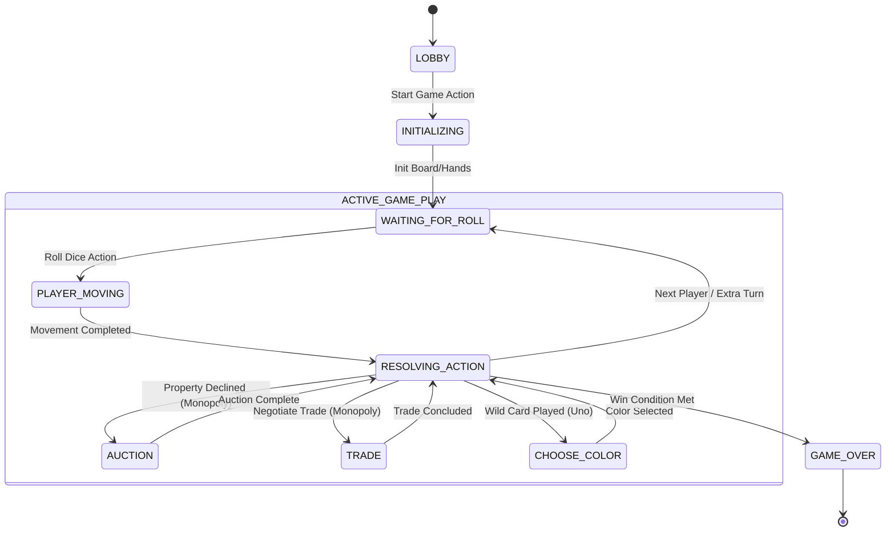

# Research and Design Report: Modular Turn-Based Game Engine Architecture
**Author:** Senior Game Systems Engineer  
**Date:** June 2026  
**Status:** Approved for Implementation

---

## 1. Architectural Overview & System Design

To support a wide range of multiplayer turn-based board and card games (such as Monopoly, Ludo, Uno, and Snakes & Ladders) under a single platform, the game portal requires a unified, decoupled, and highly extensible game engine architecture. 

The architecture is built on a **Server-Authoritative, Event-Driven Client-Server model**. The game rules are completely decoupled from the transport, rendering, and networking layers. This ensures that the same engine code can run in a headless server environment (for authoritative validation and matchmaking) and inside a client runtime (for local simulation, client-side prediction, and single-player offline mode).

### Core Design Patterns
1. **Strategy Pattern (Game Rulesets):** Each game ruleset (e.g., `MonopolyRuleset`, `UnoRuleset`) implements a common ruleset interface. The core runner remains agnostic of specific rules.
2. **Command Pattern (Game Actions):** All player actions are represented as serializable commands containing the player identity, action type, and payload. This simplifies verification, transmission, auditing, and replayability.
3. **State Pattern (State Machine):** Game states are managed through explicit, immutable state machines where transitions are strictly governed by active sub-states.
4. **Observer Pattern (Event Journal):** Side effects and visual events (e.g., animations, audio triggers, UI changes) are captured as an event journal emitted by the rule engine, allowing clients to reconstruct the visual narrative step-by-step.

---

## 2. Turn-Based State Machine Design

Turn-based games are highly structured sequences of player decisions and automated events. We define a hierarchical state machine model consisting of:
*   **Global Game State:** (e.g., `LOBBY`, `INITIALIZING`, `ACTIVE`, `PAUSED`, `GAME_OVER`)
*   **Turn-Level Sub-State:** (e.g., `WAITING_FOR_ROLL`, `PLAYER_MOVING`, `RESOLVING_BOARD_ACTION`, `AUCTION`, `TRADE`, `CHOOSE_COLOR`, `END_TURN`)

### Generic State Flow & Turn Lifecycle


### State Transition Tables

Each game type defines its own state transition matrix. Below are the state transition tables representing the flow for the four target games.

#### A. Monopoly State Transition Table
| Current Sub-State | Action / Trigger | Next Sub-State | Ruleset Side-Effects |
| :--- | :--- | :--- | :--- |
| `WAITING_FOR_ROLL` | `ROLL_DICE` | `PLAYER_MOVING` | Roll dice, calculate new board index, check for doubles. |
| `PLAYER_MOVING` | `MOVEMENT_COMPLETE` | `RESOLVING_ACTION` | Lands on tile. Trigger rent calculation, buy prompt, or card draw. |
| `RESOLVING_ACTION`| `BUY_PROPERTY` | `END_TURN` | Deduct money, assign title deed, update player inventory. |
| `RESOLVING_ACTION`| `DECLINE_PROPERTY`| `AUCTION` | Put property up for bidding. Initialize auction timer. |
| `AUCTION` | `BID` / `FOLD` | `AUCTION` | Update current highest bidder and bid amount. |
| `AUCTION` | `AUCTION_TIMEOUT` | `END_TURN` / `RESOLVING_ACTION` | Transfer property to winner, deduct cash, exit auction state. |
| `RESOLVING_ACTION`| `INITIATE_TRADE` | `TRADE` | Freeze normal flow, display trade proposal UI. |
| `TRADE` | `ACCEPT_TRADE` | `RESOLVING_ACTION` | Swap assets, update money balances, return to active player's turn. |
| `RESOLVING_ACTION`| `DRAW_CARD` | `RESOLVING_ACTION` | Draw Chance/Community Chest. Process card action (move, pay/get money). |
| `RESOLVING_ACTION`| `GO_TO_JAIL` | `END_TURN` | Move token to Jail, lock roll capabilities, reset double counter. |
| `END_TURN` | `END_TURN` | `WAITING_FOR_ROLL` | Select next active player in turn order; reset doubles roll count. |

#### B. Ludo State Transition Table
| Current Sub-State | Action / Trigger | Next Sub-State | Ruleset Side-Effects |
| :--- | :--- | :--- | :--- |
| `WAITING_FOR_ROLL` | `ROLL_DICE` | `EVALUATING_MOVES` | Roll single die. If rolled 6, check if home tokens can emerge. |
| `EVALUATING_MOVES` | `NO_VALID_MOVES` | `END_TURN` | Auto-trigger if all tokens are locked and roll != 6. |
| `EVALUATING_MOVES` | `SELECT_TOKEN` | `PLAYER_MOVING` | Validate that the token can move the rolled steps. |
| `PLAYER_MOVING` | `MOVEMENT_COMPLETE` | `RESOLVING_ACTION` | Land on space. If landing on opponent token (non-safe), kick back to yard. |
| `RESOLVING_ACTION`| `ROLL_AGAIN` | `WAITING_FOR_ROLL` | Triggered if active player rolled a 6 or captured an opponent token. |
| `RESOLVING_ACTION`| `MOVE_RESOLVED` | `END_TURN` | Proceed to next player. |
| `END_TURN` | `END_TURN` | `WAITING_FOR_ROLL` | Shift active player index to next player. |

#### C. Uno State Transition Table
| Current Sub-State | Action / Trigger | Next Sub-State | Ruleset Side-Effects |
| :--- | :--- | :--- | :--- |
| `WAITING_FOR_PLAY` | `PLAY_CARD` | `RESOLVING_CARD_EFFECT`| Verify match (color/value/wild). Remove card from hand to discard pile. |
| `WAITING_FOR_PLAY` | `DRAW_CARD` | `RESOLVING_DRAW` | Draw top card. If card is playable, prompt player; otherwise auto-end turn. |
| `RESOLVING_DRAW` | `PLAY_DRAWN_CARD`| `RESOLVING_CARD_EFFECT`| Process played card. |
| `RESOLVING_DRAW` | `KEEP_DRAWN_CARD`| `END_TURN` | Card added to hand. |
| `RESOLVING_CARD_EFFECT`| `WILD_PLAYED` | `CHOOSE_COLOR` | Pause turn progression. Await color selection. |
| `RESOLVING_CARD_EFFECT`| `SKIP_PLAYED` | `END_TURN` | Skip next player in queue (increment turn pointer by 2). |
| `RESOLVING_CARD_EFFECT`| `REVERSE_PLAYED`| `END_TURN` | Invert turn order array. |
| `RESOLVING_CARD_EFFECT`| `DRAW_TWO_PLAYED`| `END_TURN` | Force next player to draw 2 cards and skip their turn. |
| `CHOOSE_COLOR` | `SELECT_COLOR` | `END_TURN` | Set active discard color to selection. |
| `END_TURN` | `CHECK_UNO_RULE`| `WAITING_FOR_PLAY` | If player has 1 card left and didn't yell "Uno" before next play, draw 2. |

#### D. Snakes & Ladders State Transition Table
| Current Sub-State | Action / Trigger | Next Sub-State | Ruleset Side-Effects |
| :--- | :--- | :--- | :--- |
| `WAITING_FOR_ROLL` | `ROLL_DICE` | `PLAYER_MOVING` | Roll die (1-6). Calculate destination cell. |
| `PLAYER_MOVING` | `MOVEMENT_COMPLETE` | `RESOLVING_ACTION` | Token lands on tile. Check if tile is a snake head or ladder base. |
| `RESOLVING_ACTION`| `CLIMB_LADDER` | `PLAYER_MOVING` | Relocate token to top of the ladder. |
| `RESOLVING_ACTION`| `SLIDE_SNAKE` | `PLAYER_MOVING` | Relocate token to tail of the snake. |
| `RESOLVING_ACTION`| `POSITION_RESOLVED`| `END_TURN` | Stabilize token position. |
| `END_TURN` | `END_TURN` | `WAITING_FOR_ROLL` | Cycle turn to next player in list. |

---

## 3. Extensible Game Rule Interface

To allow any ruleset to plug dynamically into the core engine runtime, we establish a rigid TypeScript API contract. The core runner does not manage game mechanics; instead, it orchestrates network sync, audits actions, and delegates calculations to classes implementing the `IGameRuleset` interface.

```typescript
/**
 * Generic Player representation.
 */
export interface IPlayer {
  id: string;
  name: string;
  avatarUrl?: string;
  isBot: boolean;
}

/**
 * Base Game Action representation. All actions are serializable commands.
 */
export interface GameAction {
  type: string;
  playerId: string;
  payload: Record<string, any>;
  timestamp: number;
}

/**
 * The base game state fields required for engine management.
 * Game-specific states (e.g. Ludo, Monopoly) extend this interface.
 */
export interface GameState {
  gameId: string;
  gameType: string;
  status: 'LOBBY' | 'INITIALIZING' | 'ACTIVE' | 'PAUSED' | 'GAME_OVER';
  players: IPlayer[];
  activePlayerId: string;
  turnOrder: string[];
  turnIndex: number;
  subState: string;
  rngState: string; // Seed/State representation for reproducible RNG
  winnerId: string | null;
  historyLength: number;
}

/**
 * Visual/auditory event emitted during a state transition.
 * Sent to clients to trigger animations (e.g. token movement steps).
 */
export interface GameEvent {
  type: string;
  playerId?: string;
  payload: Record<string, any>;
}

/**
 * Result returned by the ruleset after processing an action.
 */
export interface ActionResult<S extends GameState = GameState> {
  isValid: boolean;
  error?: string;
  newState?: S;
  events: GameEvent[]; // Sequential animation/UI cues
}

/**
 * Unified Game Ruleset Interface.
 * All games (Monopoly, Ludo, Uno, Snakes & Ladders) must implement this.
 */
export interface IGameRuleset<S extends GameState = GameState, A extends GameAction = GameAction> {
  gameType: string;

  /**
   * Initializes the game state.
   */
  initialize(players: IPlayer[], config: Record<string, any>, seed: number): S;

  /**
   * Processes a player action, performs validation, and returns the modified state and events.
   * This is a pure function.
   */
  processAction(currentState: S, action: A): ActionResult<S>;

  /**
   * Filters the raw game state to remove hidden information (Fog-of-War).
   * E.g., hiding other players' cards in Uno, or face-down deck cards.
   */
  getPlayerState(currentState: S, playerId: string): Record<string, any>;

  /**
   * Evaluates if a player has met the victory conditions.
   */
  checkWinConditions(currentState: S): string | null;
}
```

### Decoupled State & Rule Engine Implementation

The core runtime uses a class wrapping the ruleset. It takes inbound actions, passes them through the ruleset, updates the internal state, and broadcasts serialized updates.

```typescript
export class GameEngineManager {
  private currentState: GameState;
  private ruleset: IGameRuleset;
  private actionLog: GameAction[] = [];

  constructor(ruleset: IGameRuleset) {
    this.ruleset = ruleset;
  }

  public initGame(players: IPlayer[], config: Record<string, any>, seed: number): GameState {
    this.currentState = this.ruleset.initialize(players, config, seed);
    return this.currentState;
  }

  public handleIncomingAction(action: GameAction): ActionResult {
    // 1. Authoritative Validation
    if (this.currentState.status !== 'ACTIVE' && this.currentState.status !== 'INITIALIZING') {
      return { isValid: false, error: 'Game is not in active state.', events: [] };
    }

    if (action.playerId !== this.currentState.activePlayerId && !this.isOutofTurnActionAllowed(action)) {
      return { isValid: false, error: 'It is not this player\'s turn.', events: [] };
    }

    // 2. Delegate execution to pure ruleset function
    const result = this.ruleset.processAction(this.currentState, action);

    if (result.isValid && result.newState) {
      this.currentState = result.newState;
      this.actionLog.push(action);
      this.currentState.historyLength = this.actionLog.length;

      // 3. Post-Process Win Conditions
      const winner = this.ruleset.checkWinConditions(this.currentState);
      if (winner) {
        this.currentState.status = 'GAME_OVER';
        this.currentState.winnerId = winner;
      }
    }

    return result;
  }

  private isOutofTurnActionAllowed(action: GameAction): boolean {
    // Certain actions like Monopoly trades, auctions, or Uno "Draw Penalty" / "Saying Uno" can occur out of turn.
    const outOfTurnActions = ['INITIATE_TRADE', 'ACCEPT_TRADE', 'BID', 'FOLD', 'DECLARE_UNO', 'CHALLENGE_UNO'];
    return outOfTurnActions.includes(action.type);
  }

  public getAuditedState(playerId: string): Record<string, any> {
    return this.ruleset.getPlayerState(this.currentState, playerId);
  }
}
```

### Fog-of-War / Hidden Information Handling
Games like **Uno** require hidden states. If a player's client holds the full state, players could inspect the browser memory/network inspect logs to see opponents' hands.
*   **The Server State** holds the full `GameState` containing a `hands: Record<string, Card[]>` dictionary and the full order of the `drawDeck`.
*   **The Client State** is generated via `getPlayerState(state, playerId)`. It replaces opponent hand arrays with arrays of `cardCount` integers or placeholder "card back" objects. The `drawDeck` is serialized merely as a count of remaining cards.

---

## 4. Local vs. Remote Game Loops

Synchronization in multiplayer gaming requires balancing **fairness (prevention of cheating)** and **responsiveness (low latency feel)**.

```
       [ Client A ]                             [ Server ]                             [ Client B ]
            |                                       |                                       |
     1. Local Prediction                             |                                       |
      (optimistic update)                            |                                       |
            |---(send action "Play Card")---------->|                                       |
            |                                 2. Validate                                   |
            |                                 3. Commit state                               |
            |                                 4. Generate random outcome                    |
            |<--(acknowledgement + events)----------|---(broadcast state update + events)-->|
            |                                       |                                       |
     5. Reconcile State                             |                                6. Play visual
     (roll back if invalid)                         |                                   animations
```

### 1. Server Authority & Verification
The Server is the single source of truth.
*   Clients submit `GameAction` payloads.
*   The server executes validation in a sandbox running the same `processAction()` logic.
*   If valid, the server transitions the state and broadcasts the delta update or new state.
*   If invalid (e.g., manipulation of card indices, invalid moves), the server rejects the action and forces a full state sync to restore the client to the authoritative state.

### 2. Seed-Based Deterministic RNG
To eliminate server-side query lag for random roll operations and guarantee auditable replays, random events (dice rolls, card shuffles) are calculated using a seed-based **Pseudo-Random Number Generator (PRNG)**.
*   Upon game initialization, a secure random seed is generated on the server and injected into `GameState.rngState`.
*   Every roll or card draw mutates the `rngState` deterministically.
*   This allows both server and client to run the identical mathematical generator, guaranteeing they calculate the exact same outcome for a given turn index, removing any network round-trip delay for rolling calculations.

#### PRNG Implementation (Mulberry32)
```typescript
export class DeterministicRNG {
  private state: number;

  constructor(seed: number) {
    this.state = seed;
  }

  /**
   * Generates a 32-bit random unsigned integer.
   */
  public nextInt(): number {
    let t = this.state += 0x6D2B79F5;
    t = Math.imul(t ^ (t >>> 15), t | 1);
    t ^= t + Math.imul(t ^ (t >>> 7), t | 61);
    return (t ^ (t >>> 14)) >>> 0;
  }

  /**
   * Returns a float value between [0, 1).
   */
  public nextFloat(): number {
    return this.nextInt() / 4294967296;
  }

  /**
   * Simulates a dice roll (min to max).
   */
  public rollRange(min: number, max: number): number {
    return Math.floor(this.nextFloat() * (max - min + 1)) + min;
  }

  /**
   * Shuffles an array in place deterministically.
   */
  public shuffle<T>(array: T[]): T[] {
    const copy = [...array];
    for (let i = copy.length - 1; i > 0; i--) {
      const j = Math.floor(this.nextFloat() * (i + 1));
      [copy[i], copy[j]] = [copy[j], copy[i]];
    }
    return copy;
  }

  public serialize(): string {
    return this.state.toString();
  }
}
```

### 3. Client-Side Prediction & Optimistic Updates
To keep the UI responsive, the client should not wait for server network latency before animating client-driven actions.
1.  **Optimistic Updates:** When Client A performs `PLAY_CARD` in Uno, the client immediately updates the local UI: the card moves from the player's hand to the discard pile.
2.  **Transition Queue:** Visual animations (like Ludo tokens stepping across tiles or Monopoly tokens running around the board) are queued using the `GameEvent` list.
3.  **State Reconciliation:** When the server replies with the authoritative response:
    *   If it matches the client's local calculation, the client acknowledges the prediction and continues.
    *   If the server returns an error (e.g. action timed out, or card was unplayable due to latency), the client resets its state to the server's state, performing a **Rollback** by reverting UI positions and restoring cards to the hand.

---

## 5. Game State Serialization & Auditing

For data persistence, matchmaking handoffs, and debugging, the entire game state is serializable to a single, structured JSON document.

### 1. General Game State JSON Schema
```json
{
  "$schema": "http://json-schema.org/draft-07/schema#",
  "title": "GameState",
  "type": "object",
  "properties": {
    "gameId": { "type": "string" },
    "gameType": { "type": "string", "enum": ["MONOPOLY", "LUDO", "UNO", "SNAKES_LADDERS"] },
    "status": { "type": "string", "enum": ["LOBBY", "INITIALIZING", "ACTIVE", "PAUSED", "GAME_OVER"] },
    "players": {
      "type": "array",
      "items": {
        "type": "object",
        "properties": {
          "id": { "type": "string" },
          "name": { "type": "string" },
          "isBot": { "type": "boolean" }
        },
        "required": ["id", "name", "isBot"]
      }
    },
    "activePlayerId": { "type": "string" },
    "turnOrder": { "type": "array", "items": { "type": "string" } },
    "turnIndex": { "type": "integer" },
    "subState": { "type": "string" },
    "rngState": { "type": "string" },
    "winnerId": { "type": ["string", "null"] },
    "historyLength": { "type": "integer" },
    "gameSpecificState": { "type": "object" }
  },
  "required": [
    "gameId", "gameType", "status", "players", "activePlayerId", 
    "turnOrder", "turnIndex", "subState", "rngState", "winnerId", 
    "historyLength", "gameSpecificState"
  ]
}
```

### 2. Game-Specific State Payloads

#### A. Ludo State Payload (`gameSpecificState`)
```json
{
  "boardLayout": "standard_52_tiles",
  "diceValue": 5,
  "tokens": {
    "player_1": [
      { "tokenId": "red_1", "position": -1, "status": "YARD" },
      { "tokenId": "red_2", "position": 8, "status": "TRACK" },
      { "tokenId": "red_3", "position": 51, "status": "HOME_STRETCH" },
      { "tokenId": "red_4", "position": 57, "status": "HOME" }
    ],
    "player_2": [
      { "tokenId": "green_1", "position": -1, "status": "YARD" }
    ]
  },
  "safeZones": [0, 8, 13, 21, 26, 34, 39, 47]
}
```

#### B. Monopoly State Payload (`gameSpecificState`)
```json
{
  "doubleRollCount": 0,
  "bankCash": 20500,
  "properties": {
    "board_index_1": { "ownerId": "player_1", "mortgaged": false, "houses": 2, "hotel": false },
    "board_index_3": { "ownerId": null, "mortgaged": false, "houses": 0, "hotel": false }
  },
  "inventories": {
    "player_1": {
      "cash": 1250,
      "jailCards": 1,
      "inJail": false,
      "jailTurns": 0
    },
    "player_2": {
      "cash": 450,
      "jailCards": 0,
      "inJail": true,
      "jailTurns": 2
    }
  },
  "activeAuction": {
    "propertyIndex": 3,
    "currentBid": 140,
    "highestBidderId": "player_1",
    "activeBidders": ["player_1", "player_2"],
    "timeLeftMs": 8500
  }
}
```

#### C. Uno State Payload (`gameSpecificState`)
```json
{
  "discardPile": [
    { "color": "RED", "value": "7" },
    { "color": "BLUE", "value": "SKIP" }
  ],
  "currentSuit": "RED",
  "direction": "FORWARD",
  "hands": {
    "player_1": [
      { "id": "card_01", "color": "RED", "value": "9" },
      { "id": "card_02", "color": "WILD", "value": "WILD_DRAW_FOUR" }
    ],
    "player_2": [
      { "id": "card_03", "color": "GREEN", "value": "2" }
    ]
  },
  "drawDeckCount": 42,
  "unoDeclared": {
    "player_1": false,
    "player_2": true
  }
}
```

#### D. Snakes & Ladders State Payload (`gameSpecificState`)
```json
{
  "boardSize": 100,
  "diceValue": 4,
  "positions": {
    "player_1": 42,
    "player_2": 89
  },
  "snakes": {
    "99": 7,
    "92": 35,
    "54": 19
  },
  "ladders": {
    "4": 14,
    "9": 31,
    "51": 67
  }
}
```

---

## 6. Action History Log & Patching

Rather than syncing the entire global state on every turn (which is highly inefficient for fast connection loops), the engine uses **Delta Updates** and **State Patches**.

### 1. Action History Log / Replay Journal
The engine tracks an array of operations. Replaying this journal starting from the initial setup (seed + config) is sufficient to recreate the exact final state of the game board. This makes it trivial to support offline logging, replay modes, and cheat detection.

```json
[
  {
    "type": "INITIALIZE",
    "playerId": "system",
    "payload": {
      "players": ["player_1", "player_2"],
      "seed": 148929312
    },
    "timestamp": 1782500000000
  },
  {
    "type": "ROLL_DICE",
    "playerId": "player_1",
    "payload": {
      "diceValue": [4, 2]
    },
    "timestamp": 1782500012000
  },
  {
    "type": "BUY_PROPERTY",
    "playerId": "player_1",
    "payload": {
      "propertyIndex": 6
    },
    "timestamp": 1782500025000
  }
]
```

### 2. Delta Updating via RFC 6902 (JSON Patch)
To update active clients with minimal network payload, changes are calculated using the JSON Patch standard. 

For instance, when a player moves in Ludo, the server returns the following patch payload:

```json
{
  "type": "GAME_STATE_PATCH",
  "version": 42,
  "patch": [
    { "op": "replace", "path": "/gameSpecificState/tokens/player_1/1/position", "value": 13 },
    { "op": "replace", "path": "/gameSpecificState/tokens/player_1/1/status", "value": "TRACK" },
    { "op": "replace", "path": "/activePlayerId", "value": "player_2" },
    { "op": "replace", "path": "/subState", "value": "WAITING_FOR_ROLL" },
    { "op": "replace", "path": "/rngState", "value": "39201948" }
  ]
}
```

This delta format reduces network payloads by up to 95% compared to raw full-state serialization, ensuring fast execution, lower bandwidth usage, and clean handling of multi-client networking.
