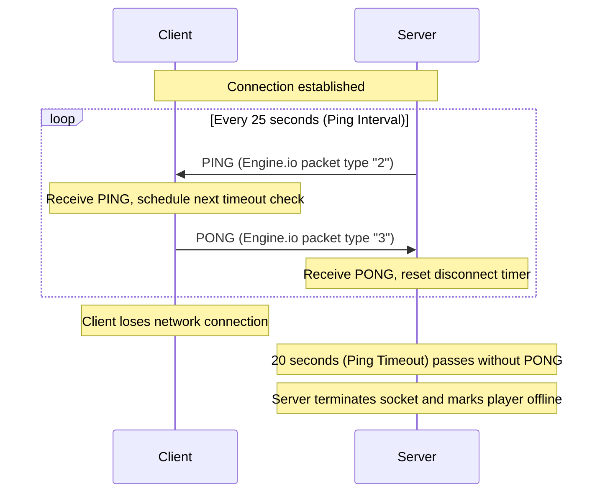
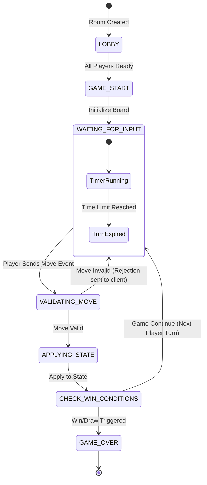
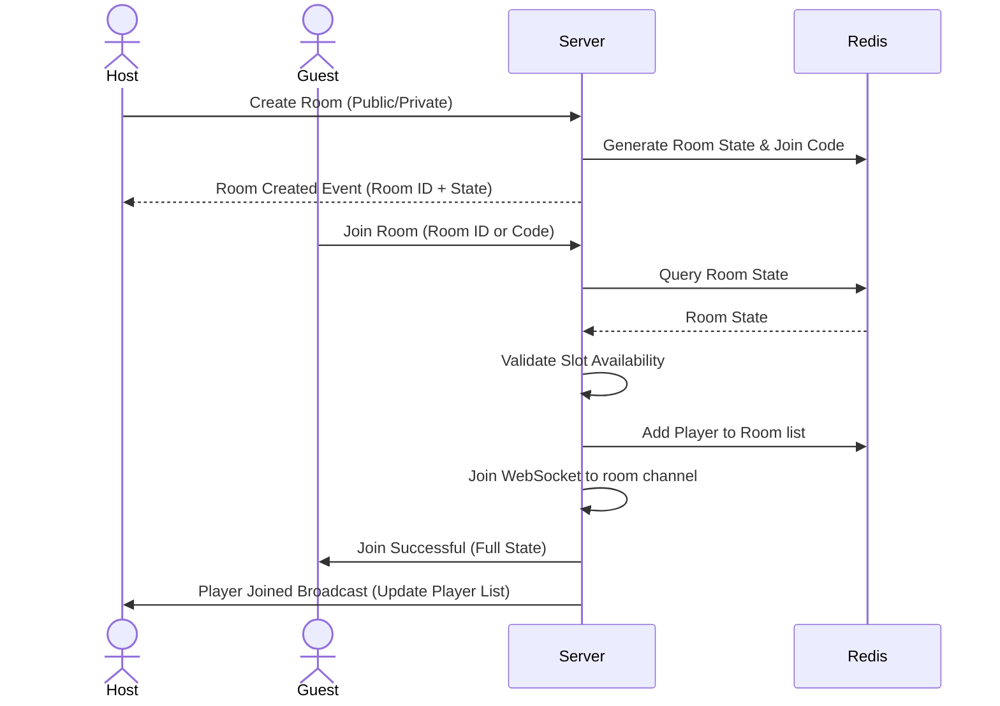
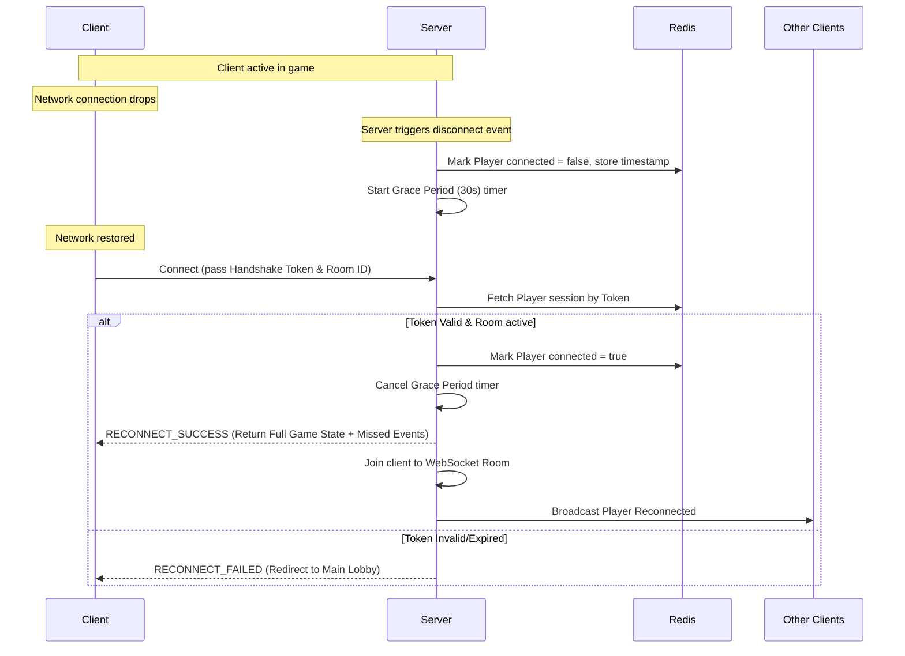

# Real-Time Multiplayer Networking Architecture for Web-Based Board Games

This document outlines the networking design, protocols, room management, and state synchronization patterns for a real-time, web-based board game portal. Board games are distinct from fast-paced action games (like shooters or MMOs) in that they are turn-based, state-driven, and require strict validation, but still demand low-latency interactions and high resilience to connectivity drops.

---

## 1. Protocol Architecture: WebSockets vs. Socket.io

When designing real-time transport layers for browser-based games, the choice typically narrows to raw **WebSockets (RFC 6455)** or **Socket.io** (a wrapper library built on top of Engine.io).

### Comparison Matrix

| Criteria | Raw WebSockets | Socket.io |
| :--- | :--- | :--- |
| **Transport Layer** | Pure TCP connection upgrade (`ws://` or `wss://`). | Initially HTTP long-polling, upgrading to WebSockets automatically. |
| **Connection Overhead** | Minimal. Base frames add 2-10 bytes overhead per message. | Higher. Wraps messages in custom event metadata (JSON framing). |
| **Reconnection** | Must be implemented manually (backoff, state tracking). | Built-in automatic reconnection with backoff configuration. |
| **Multiplexing / Rooms**| Manual implementation required. | Native namespaces and "rooms" implementation on the server. |
| **Heartbeat / Ping** | Native ping/pong frames supported by RFC, but browser API cannot send them manually. | Custom heartbeat mechanism handled in user space. |
| **Client Size** | 0 bytes extra (built-in browser API). | ~10KB-15KB minified and gzipped client library. |

### Heartbeat / Ping-Pong Mechanism

To detect dead connections (such as silent cellular dropouts or crashed client processes), a bidirectional heartbeat is required. 



* **Socket.io Implementation**: Socket.io handles this at the Engine.io layer. The server sends a `PING` event at a configured `pingInterval` (default: 25s). If the client does not respond with a `PONG` within `pingTimeout` (default: 20s), the server triggers a disconnect event.
* **Raw WebSocket Implementation**: In Node.js `ws` library, the server sends raw TCP ping frames (`socket.ping()`) at regular intervals. The browser automatically responds with a pong frame (handled by the browser engine). The server listens to the `pong` event to keep the connection alive.

---

## 2. Server Authoritative State Synchronization

In a web-based board game portal, **the server must be the single source of truth**. Clients submit *intents* (moves), and the server evaluates, executes, and broadcasts the resulting state.

### Game Loop Models: Tick-Based vs. Event-Driven

Unlike action games that run on a high-frequency tick rate (30Hz or 60Hz), board games are primary candidates for **Event-Driven State Machines**.



1. **Event-Driven Loop (Recommended)**: 
   - The server stays idle until a client sends a message (e.g., `MAKE_MOVE`).
   - The server validates the action against the current game state, updates the database/memory, and broadcasts the update.
   - **Advantage**: Low CPU consumption on the server, scales extremely well.
2. **Hybrid Tick Loop (For Timed Games)**:
   - For board games with chess clocks or turn duration limits, a light server-side timer/ticker (e.g., 1Hz check) runs to decrement active player clocks and force a turn swap if a timeout occurs.

### Move Validation Flow
1. **Client Action**: Player drags a token or makes a move. The client registers this optimistically (showing a visual transition) but does not mark the turn complete.
2. **Server Verification**: The client sends a payload containing the action (e.g., `{ type: "MOVE", from: "e2", to: "e4", playerId: "usr_99" }`).
3. **Execution**: The server validates:
   - Is it the player's turn?
   - Is the move valid according to game rules?
   - Does the player have the authority to move this piece?
4. **Broadcast vs Rollback**:
   - **Valid**: Server updates state, updates the turn owner, and broadcasts the state update.
   - **Invalid**: Server sends an error event back to the client (`MOVE_REJECTED`), prompting the client to rollback the piece to its original position.

### State Update Broadcast & Serialization

To keep client views aligned with the server state, update messages should be structured to limit bandwidth and support latency compensation:

1. **State-Event Replication (Delta Updates)**: Instead of sending the full game board (which could be large in games like Carcassonne or Settlers of Catan) on every move, send the delta patch:
   ```json
   {
     "event": "GAME_STATE_DELTA",
     "sequenceId": 45,
     "delta": {
       "board.e2": null,
       "board.e4": { "type": "pawn", "color": "white" },
       "activePlayer": "player_black",
       "turnDeadline": 1782481020000
     }
   }
   ```
2. **Serialization Formats**:
   - **JSON**: Human-readable, native to JS, but has high text overhead. Excellent for low-complexity games.
   - **MessagePack**: Binary-encoded JSON. Reduces payload size by ~30-50% with zero code complexity changes.
   - **Protocol Buffers / Schema-Based**: Highly optimized binary format. Extremely fast serialization/deserialization, minimal payload, but requires compiling schemas (`.proto` files). Recommended for complex games with massive state trees.

---

## 3. Lobby and Room Management

Lobbies manage matches before they start, coordinating players, spectators, and connection states.

### Lobby State Schema (Redis Hash Reference)

```json
{
  "roomId": "room_xyz123",
  "status": "LOBBY", // LOBBY, PLAYING, ENDED
  "visibility": "PUBLIC", // PUBLIC, PRIVATE
  "joinCode": "7482", // Used for private rooms
  "maxPlayers": 4,
  "hostId": "usr_alice",
  "players": [
    { "id": "usr_alice", "username": "Alice", "ready": true, "connected": true },
    { "id": "usr_bob", "username": "Bob", "ready": false, "connected": true }
  ],
  "spectators": [
    { "id": "usr_charlie", "username": "Charlie", "connected": true }
  ]
}
```

### Lobby Lifecycle Flows

#### 1. Room Creation and Joining


#### 2. Host Transfer Protocol
If the host player leaves or disconnects permanently, ownership must be migrated to avoid closing the game.
1. **Grace Period**: The server detects the host has disconnected. It waits for a reconnection grace period (e.g., 30 seconds).
2. **Migration Trigger**: If the host fails to reconnect, the server selects the next connected player in the `players` array order:
   ```typescript
   function migrateHost(room: RoomState): string | null {
       const nextHost = room.players.find(p => p.connected && p.id !== room.hostId);
       if (nextHost) {
           room.hostId = nextHost.id;
           return nextHost.id;
       }
       return null; // Room becomes empty, schedules closure
   }
   ```
3. **Notification**: Broadcast a `HOST_CHANGED` event to all clients to update UI controls (e.g., "Start Game" buttons).

---

## 4. Disconnection & Reconnection Architecture

Web connections are volatile. Mobile devices change towers, Wi-Fi drops momentarily, or users accidentally refresh the browser. The architecture must handle this without aborting games.

### State Persistence Model

To support reconnection, the active game state must not live purely within a WebSocket's closure or memory.
* **Transient State (In-Memory / Redis)**: Store active room and player session schemas in Redis. Redis is ideal because it is fast, has native TTL capabilities (to auto-cleanup abandoned rooms), and can be shared across multiple stateless node server instances.
* **Permanent State (Relational/NoSQL Database)**: Save game history, player stats, and final outcomes to Postgres or MongoDB once the game changes status to `ENDED`.

### Reconnection Sequence Diagram



### Catch-Up Synchronization (Replay Buffer)

When a client reconnects, the game board state might have progressed (e.g., other players' turn timers expired, or game events occurred).
1. **Full State Sync (Recommended for Board Games)**: 
   Upon reconnection, the server sends a complete snapshot of the game board and room status (`GAME_FULL_STATE`). This wipes the local client state and replaces it, which is the most reliable approach for turn-based state machines.
2. **Replay Buffer (For high-frequency logs)**:
   The server stores a sliding window of historical game events in Redis (e.g., the last 50 events) with sequence numbers. The client reconnects, specifies its last received sequence ID (e.g., `ackSeqId: 42`), and the server replies with only the missed actions: `[43, 44, 45]`.

---

## 5. Concrete Code Implementations

Below is a production-ready model implementation using **Node.js + Socket.io** with TypeScript.

### Server Implementation (`server.ts`)

```typescript
import { Server, Socket } from 'socket.io';
import { createServer } from 'http';
import { v4 as uuidv4 } from 'uuid';

interface Player {
  id: string;
  username: string;
  connected: boolean;
  ready: boolean;
  handshakeToken: string;
}

interface Room {
  id: string;
  hostId: string;
  players: Player[];
  status: 'LOBBY' | 'PLAYING' | 'ENDED';
  gameState: any; // Dynamic board state representation
}

// In-memory Room store (use Redis in multi-instance production environments)
const roomStore: Record<string, Room> = {};
const playerToRoomMap: Record<string, string> = {}; // playerId -> roomId
const disconnectTimers: Record<string, NodeJS.Timeout> = {};

const httpServer = createServer();
const io = new Server(httpServer, {
  cors: { origin: '*' },
  pingInterval: 25000,
  pingTimeout: 20000,
});

io.on('connection', (socket: Socket) => {
  console.log(`Socket connected: ${socket.id}`);

  // 1. Join / Auth Handshake
  socket.on('auth', (payload: { playerId: string; token: string; roomId: string }, callback: Function) => {
    const { playerId, token, roomId } = payload;
    const room = roomStore[roomId];

    if (!room) {
      return callback({ success: false, message: 'Room not found' });
    }

    const player = room.players.find(p => p.id === playerId);
    if (!player || player.handshakeToken !== token) {
      return callback({ success: false, message: 'Invalid authentication credentials' });
    }

    // Clear any pending disconnect timeouts
    if (disconnectTimers[playerId]) {
      clearTimeout(disconnectTimers[playerId]);
      delete disconnectTimers[playerId];
      console.log(`Cancelled disconnect timer for player: ${playerId}`);
    }

    // Associate current socket with playerId
    socket.data.playerId = playerId;
    socket.data.roomId = roomId;

    // Join Socket.io room channel
    socket.join(roomId);

    // Update state to connected
    player.connected = true;
    playerToRoomMap[playerId] = roomId;

    // Acknowledge connection and return full room state
    callback({ success: true, room });

    // Notify other players
    socket.to(roomId).emit('player_reconnected', { playerId });
  });

  // 2. Room Creation
  socket.on('create_room', (payload: { playerId: string; username: string }, callback: Function) => {
    const { playerId, username } = payload;
    const roomId = uuidv4().substring(0, 8); // Short clean ID
    const token = uuidv4(); // Handshake token for reconnections

    const newRoom: Room = {
      id: roomId,
      hostId: playerId,
      players: [
        { id: playerId, username, connected: true, ready: false, handshakeToken: token }
      ],
      status: 'LOBBY',
      gameState: { board: {}, turn: playerId }
    };

    roomStore[roomId] = newRoom;
    playerToRoomMap[playerId] = roomId;
    socket.data.playerId = playerId;
    socket.data.roomId = roomId;
    socket.join(roomId);

    callback({ success: true, roomId, token, room: newRoom });
  });

  // 3. Game actions / Move validation
  socket.on('make_move', (move: { from: string; to: string }) => {
    const { playerId, roomId } = socket.data;
    if (!playerId || !roomId) return;

    const room = roomStore[roomId];
    if (!room || room.status !== 'PLAYING') return;

    // Perform game-specific validation
    const isValid = validateMove(room.gameState, playerId, move);
    if (!isValid) {
      socket.emit('move_rejected', { reason: 'Invalid move' });
      return;
    }

    // Apply move to state
    room.gameState.board[move.to] = room.gameState.board[move.from];
    delete room.gameState.board[move.from];
    
    // Change turn logic
    room.gameState.turn = getNextTurnPlayer(room);

    // Broadcast update state to all clients in the room
    io.to(roomId).emit('state_update', { gameState: room.gameState });
  });

  // 4. Handle Disconnection
  socket.on('disconnect', () => {
    const { playerId, roomId } = socket.data;
    if (!playerId || !roomId) return;

    const room = roomStore[roomId];
    if (!room) return;

    const player = room.players.find(p => p.id === playerId);
    if (player) {
      player.connected = false;
      io.to(roomId).emit('player_disconnected', { playerId });

      // Start grace period for reconnection
      disconnectTimers[playerId] = setTimeout(() => {
        handlePermanentLeave(roomId, playerId);
      }, 30000); // 30 second grace period
    }
  });
});

function handlePermanentLeave(roomId: string, playerId: string) {
  const room = roomStore[roomId];
  if (!room) return;

  room.players = room.players.filter(p => p.id !== playerId);
  delete playerToRoomMap[playerId];

  if (room.players.length === 0) {
    // Clean up empty room
    delete roomStore[roomId];
    console.log(`Room ${roomId} cleaned up due to zero active players.`);
    return;
  }

  // Handle host migration if necessary
  if (room.hostId === playerId) {
    const nextPlayer = room.players.find(p => p.connected);
    if (nextPlayer) {
      room.hostId = nextPlayer.id;
      io.to(roomId).emit('host_changed', { hostId: room.hostId });
    }
  }

  io.to(roomId).emit('player_left_permanent', { playerId });
}

function validateMove(state: any, player: string, move: any): boolean {
  // Replace with actual board logic (e.g. Chess rules, Tic-Tac-Toe grids)
  return state.turn === player;
}

function getNextTurnPlayer(room: Room): string {
  const currentIndex = room.players.findIndex(p => p.id === room.gameState.turn);
  const nextIndex = (currentIndex + 1) % room.players.length;
  return room.players[nextIndex].id;
}

httpServer.listen(3000, () => console.log('Server running on port 3000'));
```

### Client Implementation (`client.ts`)

```typescript
import { io, Socket } from 'socket.io-client';

class GameClient {
  private socket!: Socket;
  private playerId: string;
  private token: string | null = null;
  private roomId: string | null = null;
  private isReconnecting = false;

  constructor(playerId: string) {
    this.playerId = playerId;
    this.token = localStorage.getItem(`game_token_${playerId}`);
    this.roomId = localStorage.getItem(`game_room_${playerId}`);
  }

  public connect(serverUrl: string) {
    this.socket = io(serverUrl, {
      autoConnect: false,
      reconnection: true,
      reconnectionAttempts: 10,
      reconnectionDelay: 1000,
      reconnectionDelayMax: 5000,
    });

    this.socket.on('connect', () => {
      console.log('Connected to server transport');
      
      // Attempt authentication/reconnection handshake if storage credentials exist
      if (this.token && this.roomId) {
        this.attemptReconnection();
      }
    });

    this.socket.on('state_update', (data: { gameState: any }) => {
      this.onGameStateUpdated(data.gameState);
    });

    this.socket.on('player_disconnected', (data: { playerId: string }) => {
      console.log(`Player disconnected (grace period started): ${data.playerId}`);
      // Show reconnecting overlay for peer
    });

    this.socket.on('player_reconnected', (data: { playerId: string }) => {
      console.log(`Player back online: ${data.playerId}`);
    });

    this.socket.on('disconnect', (reason) => {
      console.warn(`Socket disconnected: ${reason}`);
      if (reason === 'io server disconnect') {
        // Must manually reconnect if kicked by server
        this.socket.connect();
      }
    });

    this.socket.connect();
  }

  public createRoom(username: string) {
    this.socket.emit('create_room', { playerId: this.playerId, username }, (response: any) => {
      if (response.success) {
        this.token = response.token;
        this.roomId = response.roomId;
        localStorage.setItem(`game_token_${this.playerId}`, response.token);
        localStorage.setItem(`game_room_${this.playerId}`, response.roomId);
        console.log(`Created and joined room: ${this.roomId}`);
      } else {
        console.error('Room creation failed', response.message);
      }
    });
  }

  private attemptReconnection() {
    this.isReconnecting = true;
    this.socket.emit('auth', {
      playerId: this.playerId,
      token: this.token,
      roomId: this.roomId
    }, (response: any) => {
      this.isReconnecting = false;
      if (response.success) {
        console.log('Successfully re-authenticated with existing session:', response.room);
        this.onGameStateUpdated(response.room.gameState);
      } else {
        console.warn('Re-auth failed. Credentials might have expired.');
        this.clearSession();
      }
    });
  }

  private clearSession() {
    this.token = null;
    this.roomId = null;
    localStorage.removeItem(`game_token_${this.playerId}`);
    localStorage.removeItem(`game_room_${this.playerId}`);
  }

  private onGameStateUpdated(gameState: any) {
    // Update local UI component hooks here
    console.log('New Game State:', gameState);
  }
}
```

---

## 6. Recommendations & Design Principles

To ensure high performance and an optimal player experience, apply the following design principles to the networking architecture:

1. **Leverage Secure WebSockets (`wss://`)**: Always use encrypted connections. This prevents middleboxes and cellular networks from dropping or modifying WebSocket packets.
2. **Stateless Scale-Out**: Keep socket application servers stateless. If scaling horizontally across multiple processes/nodes, bind connections to a shared Redis instance utilizing Redis adapter layers (like `@socket.io/redis-adapter`) to broadcast events across nodes.
3. **Optimistic UI with Graceful Rollbacks**: Allow client boards to perform transitions immediately, but register a validation pending indicator. If the server broadcasts a state that conflicts, perform a visual rollback animation instead of freezing the browser.
4. **Idempotent Input Processing**: Track a transaction sequence ID for player moves. If the client submits the same turn event multiple times (e.g. because of brief latency spikes), the server should ignore duplicate IDs.
5. **Decouple Game Engines from Networking**: Code game state rules in a networking-agnostic core library. This allows tests to run without starting WebSockets, and enables running the exact same rule validator on both the client (for predictive movements) and the server (for absolute authority).
